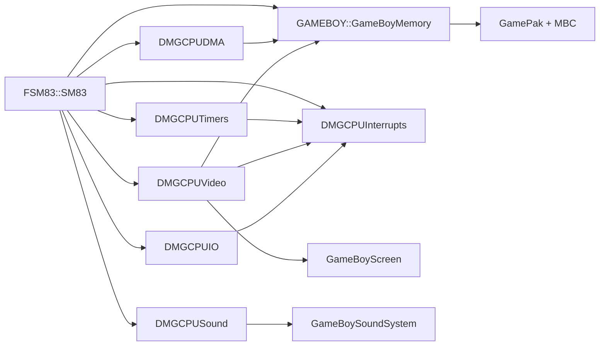

# Contrato de hardware: Nintendo Game Boy DMG-01

## Identidad y alcance

La máquina de referencia es Nintendo Game Boy `DMG-01`, con SoC `DMG-CPU B`. El objetivo es reproducir su comportamiento digital determinista y las interacciones temporalmente observables por software. Las revisiones `DMG-CPU`, A y C se conservarán como variantes futuras; no se combinarán sus peculiaridades con la revisión B.

El alcance incluye:

- CPU SM83, mapa de memoria y Boot ROM.
- Interrupciones, divisor, timer y OAM DMA.
- LCD/PPU monocroma con fondo, ventana y sprites.
- Cuatro canales de sonido y enrutamiento digital estéreo.
- Joypad y enlace serie.
- Game Pak, cabecera, ROM, RAM persistente y MBC principales.
- Pantalla, sonido y entrada de host como adaptadores externos al estado determinista.

Quedan diferidos MGB, MGL, SGB, SGB2, CGB, accesorios especiales, controladores de cartucho raros y reproducción analógica exacta por revisión de placa.

## Objetivo de fidelidad

| Dominio | Objetivo contractual |
|---|---|
| SM83 | Semántica, flags, longitud, accesos ordenados y duración de cada opcode |
| Interrupciones | Muestreo en frontera de instrucción, prioridad, entrada y retorno exactos |
| Timer/DIV | Progresión y efectos visibles por T-cycle |
| OAM DMA | Transferencia ordenada y restricciones de bus por T-cycle |
| PPU | Estado por dot, fetcher/FIFO y duración variable de Mode 3 |
| APU | Estado digital y secuenciador conscientes de ciclos |
| Joypad | Matriz, pull-ups, selección y flancos deterministas |
| Serie | Bits y reloj emulados; peer externo determinista |
| MBC | Banking y persistencia exactos para cada variante declarada |
| Analógico | Aproximado y separado del núcleo digital |

## Relojes

El reloj canónico es `4,194304 MHz`, exactamente `2^22 Hz`.

- Un **T-cycle** es una oscilación maestra y será la unidad global.
- Un **M-cycle** ocupa cuatro T-cycles.
- Un dot de PPU ocupa un T-cycle en DMG.
- Una línea LCD ocupa 456 T-cycles.
- Un frame ocupa 154 líneas, 70224 T-cycles.
- Las líneas 0-143 son visibles; 144-153 pertenecen a VBlank.
- El reloj serie interno nominal se deriva como maestro / 512.
- El secuenciador digital del APU se modelará como dominio derivado; sus divisores exactos se validarán antes del Hito 6.

No se utilizarán microsegundos ni tiempo de pared para avanzar estado emulado. Las conversiones a segundos solo se realizarán para presentación, regulación de velocidad o informes.

## Propietario de sincronización

`GAMEBOY::GameBoyComputer` será el propietario conceptual del scheduler. Cada llamada elemental avanzará un T-cycle y coordinará:

1. Eventos de host ya encolados y vencidos en ese T-cycle.
2. Fase o petición de bus del SM83, si la CPU está activa.
3. Arbitraje de CPU, PPU y DMA sobre la vista de memoria correspondiente.
4. Efectos de registros que deban ocurrir en el flanco documentado.
5. Avance de PPU, timer, DMA, serial y APU.
6. Actualización de peticiones en IF.
7. Muestreo de interrupción por la CPU solo en una frontera válida.

Este orden es un contrato de determinismo, no una afirmación aún probada del orden eléctrico interno. Los casos simultáneos se refinan mediante pruebas y se registran en `GameBoy_Risks_and_Unknowns.md`.

## Arquitectura y propiedad

`GameBoyComputer` poseerá CPU, memoria, chips y dispositivos de la placa. `GameBoyEmulator` poseerá configuración, builders, lector de archivos y ensamblaje de aplicación siguiendo los contratos de CORE. Los chips no conocerán al `Computer` concreto; intercambiarán señales lógicas, eventos o referencias de interfaz acotadas.

## Dominios de dirección

El SM83 expone un espacio lineal de 16 bits y datos de 8 bits. No existe un espacio de puertos separado: toda E/S es memory-mapped.

Se distinguirán cuatro vistas:

- **CPU:** restricciones de PPU y DMA aplicadas como las observa el SM83.
- **PPU:** VRAM/OAM y fetches internos visibles al controlador LCD.
- **DMA:** origen, destino y bloqueo propios de la transferencia OAM.
- **Física/debug:** almacenamiento real sin falsear el estado por cambiar la vista activa.

El árbitro decidirá acceso, valor y efecto lateral. Las instrucciones no contendrán excepciones específicas de Game Boy.

## Reset y Boot ROM

El contrato distingue dos estados:

1. **Power-on/reset físico:** valores propios de la revisión, antes de ejecutar firmware.
2. **Post-boot:** estado que deja la Boot ROM antes de entregar control al Game Pak.

Al arrancar, la ROM interna de 256 bytes sustituye el rango `0x0000-0x00FF`. El resto de la ROM de cartucho continúa visible. Tras la secuencia de autenticación y checksum, una escritura en el control de boot desactiva irreversiblemente el overlay hasta el siguiente reset físico.

Política:

- La ROM propietaria será un archivo aportado por el usuario.
- Se validará tamaño y hash configurado.
- Si falta, el arranque físico debe fallar con diagnóstico claro.
- Un boot sintético futuro será una opción explícita y dejará un estado post-boot documentado.
- Reiniciar dos veces con la misma configuración y entradas debe producir la misma traza.

## Interrupciones

Las cinco fuentes maskables comparten IF y IE. La prioridad es fija:

| Prioridad | Fuente | IF/IE | Vector |
|---:|---|---:|---:|
| 1 | VBlank | bit 0 | `0x0040` |
| 2 | LCD STAT | bit 1 | `0x0048` |
| 3 | Timer | bit 2 | `0x0050` |
| 4 | Serial | bit 3 | `0x0058` |
| 5 | Joypad | bit 4 | `0x0060` |

`DMGCPUInterrupts` poseerá IF, IE, la agregación y la selección prioritaria. IME y sus transiciones pertenecen a `FSM83::SM83`. La fuente propietaria solicita o libera su bit; no introduce directamente una instancia de interrupción en la CPU.

El contrato de CPU deberá cubrir `EI`, `DI`, `RETI`, HALT, el bug de HALT, peticiones con IME desactivado y peticiones que aparecen en cada frontera de muestreo.

## Arbitraje y contención

- PPU restringe VRAM y OAM según el modo LCD.
- OAM DMA copia 160 bytes con orden temporal observable.
- Durante DMA la CPU conserva solo los accesos que la revisión permita; no se aplicará una regla global hasta fijarla con evidencia.
- PPU y DMA no leen a través de la vista CPU.
- Las regiones no utilizables no se implementarán como RAM descartable.
- Un acceso denegado puede producir un valor distinto de `0xFF`; se decide por rango y revisión.

## Interfaces externas

### Game Pak

El cartucho se separa en interfaz eléctrica/lógica, controlador MBC, almacenamiento ROM/RAM/RTC, formato de archivo y persistencia de host. Cada capa podrá evolucionar sin que el parser escriba directamente en el mapa de CPU.

### Joypad

El host encola cambios de botones. `DMGCPUIO` aplica la matriz seleccionada por P14/P15, pull-ups, nivel observado y flanco de interrupción en tiempo emulado.

### Serie

El peer será un dispositivo determinista conectado o un modelo de líneas desconectadas. No se bloqueará un hilo esperando a otro proceso ni se leerá el reloj del host.

### Audio y pantalla

PPU entrega índices de color 0-3; `GameBoyScreen` decide tonos, escalado y efecto LCD. APU entrega señal digital izquierda/derecha; filtros, resampling y altavoz/auriculares pertenecen al wrapper de host.

## Persistencia y tiempo real

RAM con batería y RTC no mutarán directamente archivos durante un acceso de CPU. El estado emulado se confirmará a almacenamiento mediante puntos seguros. El RTC usará una fuente de tiempo inyectable; pruebas y save states utilizarán tiempo fijo o secuencias controladas.

## Puerta de arquitectura

Este contrato cierra identidad, reloj, propietarios, dominios de dirección, interrupciones y límites host. Los detalles marcados como incógnitas son comportamientos locales con método de validación, no decisiones estructurales abiertas.

