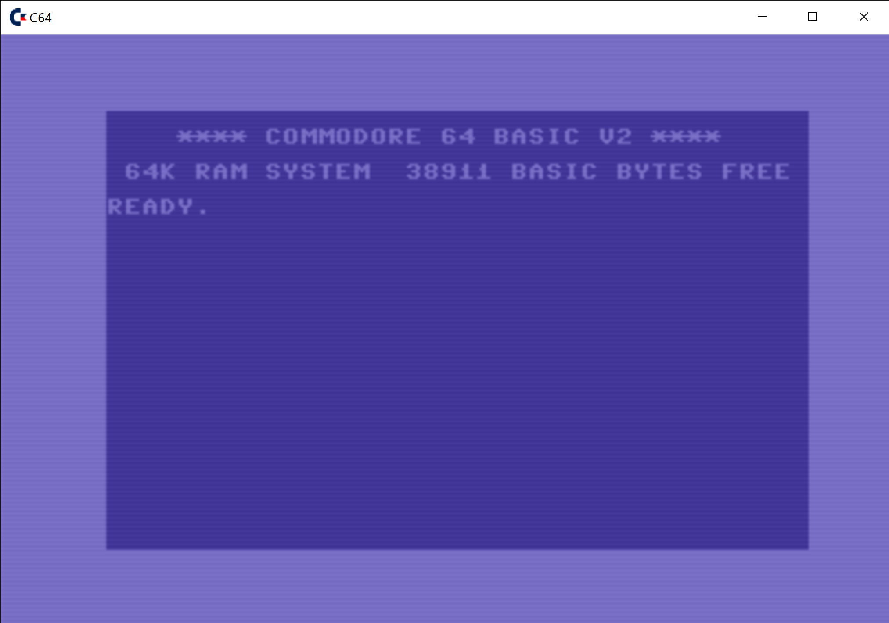

<b>Framework for Classic EMULATORS</b> 
Develop By <b>Ignacio Cea Forniés</b>. Copyright (C) 2023. 
Used allowed under GPL license. 
The framework has been developed fully in C++ (version 20) using <a href="https://visualstudio.microsoft.com/es/vs/">Visual Studio Community 2022 (64bits)</a>. 
 
For better understanding of the framework unzip <b>html.zip</b>, included in the package. 
The package includes classes to develop you own emulator, including also assembler, compiler and consoles, remote and local ones.
 
The implementation of the framework for Commodore 64 has been included. 
In that case, the behaviour of the VICII has been emulated following the fantastic article by Christian Bauer that can be found at
<a href="http://www.zimmers.net/cbmpics/cbm/c64/vic-ii.txt">Zimmers.net</a> 
 
To compile the framework the <a href="https://github.com/libsdl-org/SDL/releases/tag/release-2.26.2">SDL Core</a>, <a href="https://www.libsdl.org/projects/SDL_image/release/">SDL image</a>, <a href="https://github.com/libsdl-org/SDL_mixer">SDL Mixer</a> and <a href="https://github.com/facebookarchive/RakNet">Raknet</a> libraries are necessary.
Download them, install them and set the environmental variables: <b>SDL_HOME</b>, <b>SDL_IMAGEHOME</b>, <b>SDL_MIXERHOME</b>, <b>RAKNET_HOME</b>
  
  
The important C64 keys in a Win32 standard keyboard are: 
LEFT CONTROL         = CTRL 
RIGHT CONTROL        = CTRL 
LEFT ALT             = STOP 
SHIFT + LEFT ALT     = RUN 
PAUSE                = COMMODORE KEY 
LEFT BRACKET         = + 
RIGHT BRACKET        = * 
APOSTROPHE           = : 
BACKSLASH            = @ 
ESCAPE               = ARROW BACK 
GRAVE                = POUND 
