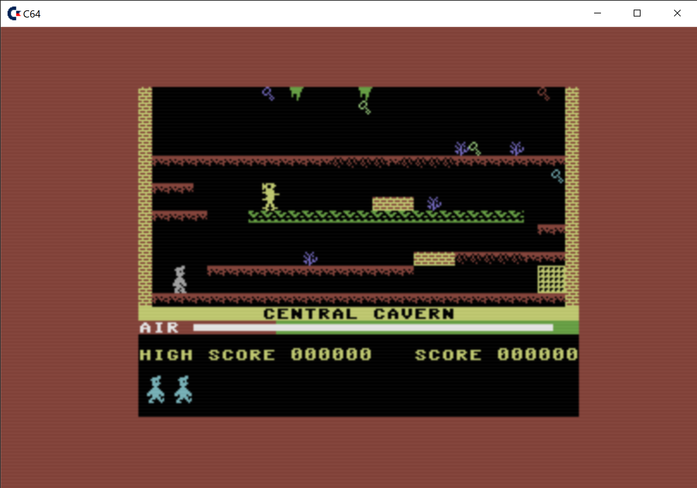
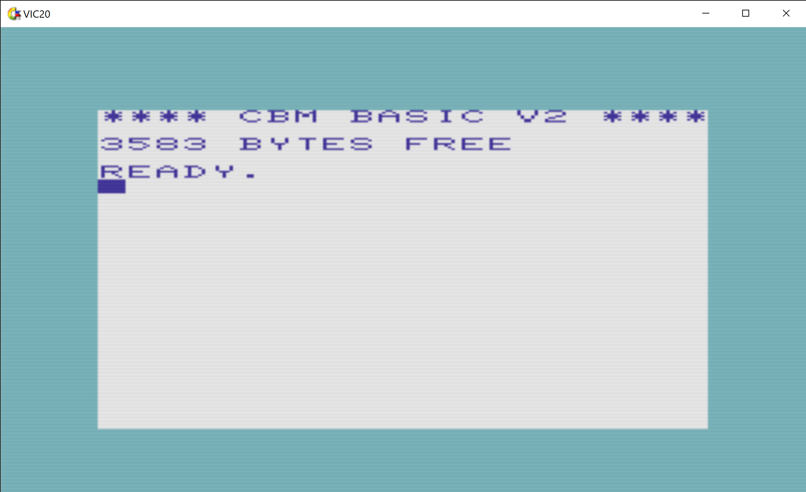
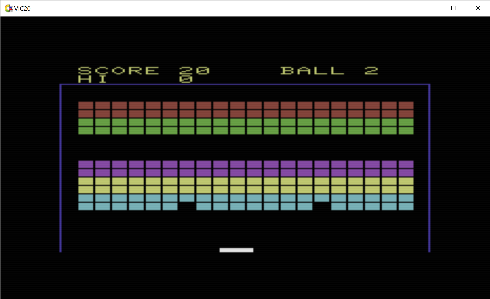

<h1><b>Framework for Classic EMULATORS (C64, VIC20, Plus4, ZX81...)</b></h1> 
Develop By <b>Ignacio Cea Forniés</b>. Copyright (C) 2023. 
Used allowed under GPL license. 
The framework has been developed fully in C++ (version 20) using <a href="https://visualstudio.microsoft.com/es/vs/">Visual Studio Community 2022 (64bits)</a>.  
For better understanding of the framework unzip <b>html.zip</b>, included in the package. 
The package includes classes to develop you own emulator, including also assembler, compiler and consoles, remote and local ones. 
The emulation of <b>COMMODORE64</b> (including Ultimmax mode), <b>VIC20</b>, <b>264 Series</b> (C16, C116 and Plus4) and <b>ZX81</b> are included. 
To compile the framework, Visual Studio compiler is needed and also the <a href="https://github.com/libsdl-org/SDL/releases/tag/release-2.26.2">SDL Core</a>, <a href="https://www.libsdl.org/projects/SDL_image/release/">SDL image</a>, <a href="https://github.com/libsdl-org/SDL_mixer">SDL Mixer</a> and <a href="https://github.com/facebookarchive/RakNet">Raknet</a> libraries are necessary. Download them, install them and set the environmental variables: <b>SDL_HOME</b>, <b>SDL_IMAGEHOME</b>, <b>SDL_MIXERHOME</b>, <b>RAKNET_HOME</b>. 

<h1><b>Commodore 64 emulator</b></h1>
The implementation of the framework for Commodore 64 has been included. 
Execute C64EmulatorC or C64Emulator /h to see the different options at starting, and the command HELP in the console to manipulate later the emulation. 
In that case, the behaviour of the VICII has been emulated following the fantastic article by Christian Bauer that can be found at: <a href="http://www.zimmers.net/cbmpics/cbm/c64/vic-ii.txt">Zimmers.net</a>. 
The implementation of the SID chip has been based on the resid libry found at: <a href="http://www.zimmers.net/anonftp/pub/cbm/crossplatform/emulators/resid/index.html">Resid library</a>.   
 
 
 
 

It has been an intention to emulate the location of the keys as they are inthe original keyboard. 
For this reason the position of the different key can be a little bit "strange" 
The important C64 keys in a Win32 standard <b>Spanish</b> keyboard are: 
LEFT CONTROL         = CTRL 
RIGHT CONTROL        = CTRL 
LEFT ALT             = STOP 
SHIFT + LEFT ALT     = RUN 
TAB                  = COMMODORE KEY 
LEFT BRACKET         = + 
RIGHT BRACKET        = * 
APOSTROPHE           = : 
BACKSLASH            = @ 
ESCAPE               = ARROW BACK 
GRAVE                = POUND 
ACCENT               = MINUS 
OPEN EXCLAMATION     = EQUAL 
OPEN BRACKET         = PLUS 
CLOSE BRACKET        = ASTERISC 
OPEN PARENTHESIS     = TWO POINTS 
CLOSE PARENTEHEIS    = ADDRESS 
COMMA                = COMMA 
PERIOD               = PERIOD 
MINUS                = SLASH 
SHIFT COMMA          = LESSER THAN 
SHIFT PERIOD         = GREATER THAN 
SHIFT MINUS          = QUESTION MARK 
Ñ                    = POINT AND COMMA 
SUPR                 = UP ARROW 

<h1><b>VIC20 emulator</b></h1>
The implementation of the framework for VIC20 has been included. 
Execute VIC20EmulatorC or VIC20Emulator /h to see the different options at starting, and the command HELP in the console to manipulate later the emulation. 
The different configurations of the VIC20 can be simulated using the parameter /w at command line (0=default,1=3k expansion,2=8k expansion,4=all).  
 
 

<h1><b>ZX81 emulator</b></h1>
The implementation of the framework for ZX81 has been included. 
Execute ZX81EmulatorC or ZX81Emulator /h to see the different options at starting, and the command HELP in the console to manipulate later the emulation. 
The different configurations of the ZX81 can be simulated using the parameter /m to indicate the ROM (ZX811, ZX812, ZX812, or ZX80) and /w (0 = default and 1=16k expansion) at command line.  
 
 

